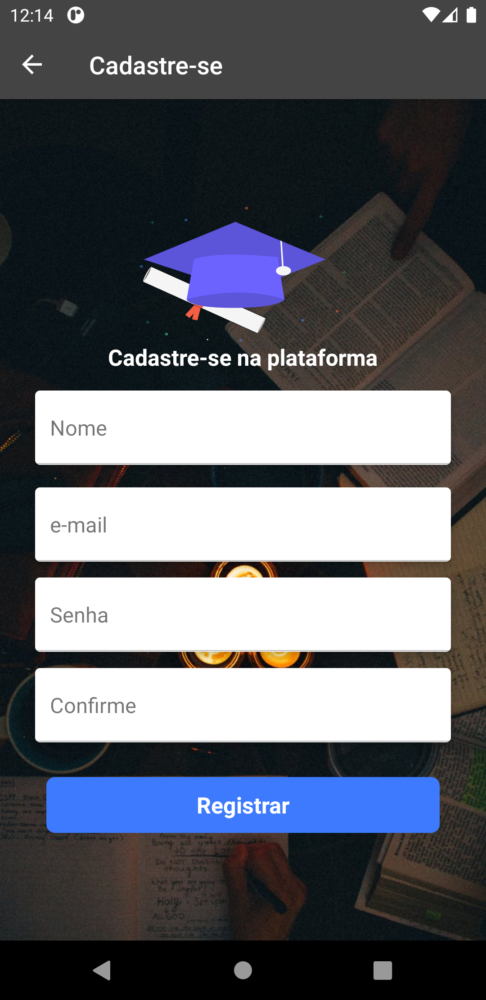
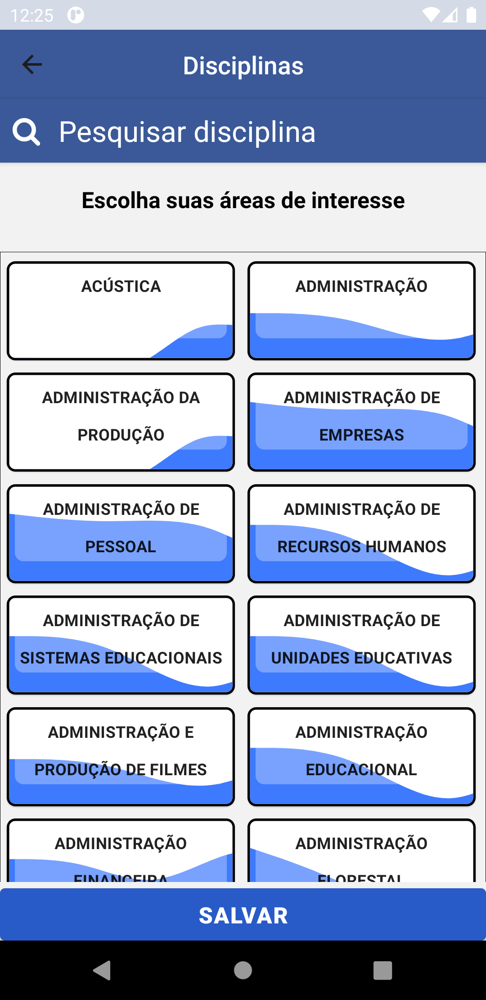

# TCC - Ciência da Computação - 2020

## Aplicativo Mobile de Suporte Estudantil

#### Aplicação desenvolvida com React Native e Node.js

**Aplicativo de suporte estudantil que fornece uma forma de busca de professores particulares através de geolocalização, chat, forum e mais**

### ScreenShots

